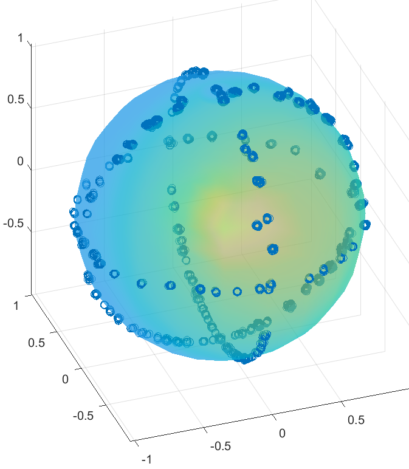

## :star2: A Brief Explanation of the Steps of Using This Library

As stated in the title, this page is just a sufficient summary of guidelines to use the MATLAB functions, hence please refer to these MATLAB files for [accelerometer](calibration_acc.m), [magnetometer](calibration_mag.m) and [documentation](../Working%20Principle/Working%20Principle.pdf) if you have any doubt.

# :notebook_with_decorative_cover: Chapters
1. [Mathematical Notations](#one-Mathematical-Notations)
2. [Accelerometer Calibration MATLAB Function](#two-Accelerometer-Calibration-MATLAB-Function)
3. [Magnetometer Calibration MATLAB Function](#three-Magnetometer-Calibration-MATLAB-Function)
4. [Tips for collecting data](#four-Tips-for-collecting-data)

## :one: Mathematical Notations

First, letters $a$ and $m$ correspond to accelerometer and magnetometer readings. 

Subscript is used to represent the axis' name, e.g. $a_x$ means x-axis accelerometer reading.

For reading before calibration, we use non-circumflex or non-hat to denote it, i.e. 

accelerometer and magnetometer reading before calibration respectively = 
```math
\begin{pmatrix}a_x\\a_y\\a_z\end{pmatrix} \ , \   \begin{pmatrix}m_x\\m_y\\m_z\end{pmatrix}
```

while for calibrated readings, circumflex or hat on the letter is used, i.e.

accelerometer and magnetometer reading after calibration respectively = 
```math
\begin{pmatrix}\hat{a_x}\\\hat{a_y}\\\hat{a_z}\end{pmatrix} \ , \   \begin{pmatrix}\hat{m_x}\\\hat{m_y}\\\hat{m_z}\end{pmatrix}
```

## :two: Accelerometer Calibration MATLAB Function

**Note:** This function is also suitable for calibrating magnetometer, when it is used without the presence of accelerometer in your project. Else if accelerometer exists, then it is recommended to use the following magnetometer calibration [below](#three-Magnetometer-Calibration-MATLAB-Function) instead.

Refer to [calibration_acc.m](calibration_acc.m), we have this function

```
[center, n_o] = calibration_acc(ax, ay, az)
```

Suppose we have $n$ sets of uncalibrated accelerometer data. We first store x-axis, y-axis and z-axis data into ```ax```, ```ay```, and ```az``` respectively, of which these three variables are arrays of n x 1 dimension.

Then we pass them into the above function. It will produce 
 ```n_o``` (3 x 3 array) and ```center``` (array of 3 dimensions). ```n_o``` is the non-orthoganality matrix, while ```center``` is the centre biases for each axis.

We apply these parameters to correct our readings reported from accelerometer later using the following equation:
```math
\begin{pmatrix}\hat{a_x}\\\hat{a_y}\\\hat{a_z}\end{pmatrix}_{normalised}=
\begin{pmatrix}
n\_o[1][1]&0&0\\
n\_o[2][1]&n\_o[2][2]&0\\
n\_o[3][1]&n\_o[3][2]&n\_o[3][3]
\end{pmatrix}
\begin{pmatrix}a_x - center[1]\\a_y - center[2]\\a_z - center[3]\end{pmatrix}
```
since
```math
n\_o[1][2] = n\_o[1][3] = n\_o[2][3] = 0
```

The above calibrated reading is a normalised reading. To make it unnormalised, we assume x-axis has an accurate scale, then an extra step is needed:

```math
\begin{pmatrix}\hat{a_x}\\\hat{a_y}\\\hat{a_z}\end{pmatrix}_{unnormalised}=
\frac{1}{n\_o[1][1]}
\begin{pmatrix}\hat{a_x}\\\hat{a_y}\\\hat{a_z}\end{pmatrix}_{normalised}
```

## :three: Magnetometer Calibration MATLAB Function

**Note:** This section requires the accelerometer to be calibrated beforehand.

In [calibration_mag.m](calibration_mag.m), we have this function

```
[transform_matrix, center, n_o, R, beta] = calibration_mag(ax, ay, az, mx, my, mz, q_est, beta)
```

Suppose we have $n$ sets of accelerometer (calibrated) and magnetometer (uncalibrated) readings, with both are obtained simultaneously in the same positions. We first store x-axis, y-axis, z-axis accelerometer data into ```ax```, ```ay```, ```az``` accordingly, while x-axis, y-axis, z-axis magnetometer data into ```mx```, ```my```, ```mz``` respectively, of which all variables are n x 1 arrays.

Now, we need to pass the initial estimates for the least square minimisation happened inside the function. The first estimate is ```q_est```, which is an array of dimension four. This variable is a quaternion that represents a rotation matrix to align the magnetometer to the accelerometer. We could set this variable with the value of {1, 0, 0, 0}, which forms an identity rotation matrix by means of $\mathbf{q} = q + \vec{q} = 1$. This is based on the assumption that both accelerometer and magnetometer are almost aligned.

The second estimate is ```beta```, which represents the cosine of theta and this theta is the projection or dot product angle between gravity and Earth's magnetic field vector. It should set based on your local magnetic inclination angle plus or subtract with $\frac{\pi}{2}$ that depends on the local reference frame convention. Please refer to Chapter 3 of the [documentation](../Working%20Principle/Working%20Principle.pdf).

The outputs of this function are as follows:
* ```transform_matrix``` is the total transformation matrix, which incorporates the misalignment, ```R``` and non-orthoganality correction, ```n_o``` matrices, .
* ```center``` stores the centre biases of x, y and z axes respectively.
* ```n_o``` is the non-orthoganality matrix.
* ```R``` is the misalignment correction matrix.
* ```beta``` is the estimated beta after least square minimisation.

We only need to apply ```transform_matrix``` and ```center``` to correct the magnetometer readings in our project, as follows:
```math
\begin{pmatrix}\hat{m_x}\\\hat{m_y}\\\hat{m_z}\end{pmatrix}_{normalised}
=
\begin{pmatrix}
transform\_matrix[1][1]&transform\_matrix[1][2]&transform\_matrix[1][3]\\
transform\_matrix[2][1]&transform\_matrix[2][2]&transform\_matrix[2][3]\\
transform\_matrix[3][1]&transform\_matrix[3][2]&transform\_matrix[3][3]
\end{pmatrix}
\begin{pmatrix}m_x - center[1]\\m_y - center[2]\\m_z - center[3]\end{pmatrix}
```

Similarly, the above output vector is a normalised vector. So, by assuming x-axis has an accurate scale, the following extra step is performed:

```math
\begin{pmatrix}\hat{m_x}\\\hat{m_y}\\\hat{m_z}\end{pmatrix}_{unnormalised}=
\frac{1}{n\_o[1][1]}
\begin{pmatrix}\hat{m_x}\\\hat{m_y}\\\hat{m_z}\end{pmatrix}_{normalised}
```

## :four: Tips for collecting data

* To ensure high accuracies for all these calibration parameters, we need to obtain the data in all possible orienatation that are able to cover or describe most of the ellipsoid's surface, e.g.

<div align="center"></div>

* For accelerometer calibration using ```calibration_acc``` as in [chapter 2](#two-Accelerometer-Calibration-MATLAB-Function), all the data should be obtained at stationary state, as to avoid any possible acceleration introduced to the data. This accelerometer calibration only needs to be performed once, since it is rarely interfered with external factors.

* For magnetometer calibration using ```calibration_acc``` as in [chapter 2](#two-Accelerometer-Calibration-MATLAB-Function), the data do not need to be captured under stationary condition.

* If using ```calibration_mag``` as in [chapter 3](#three-Magnetometer-Calibration-MATLAB-Function) for magnetometer calibration, the IMU should be tumbled in all directions gently, as to avoid any acceleration interfered with the accuracy of accelerometer's readings.

* The magnetometer calibration needs to be performed again, when we move to an environment which has different magnetic interference than the previous environment where we performed the calibration before.